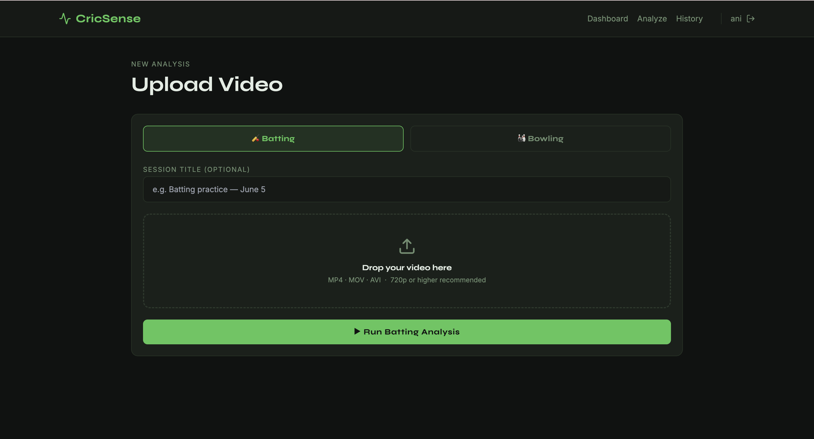
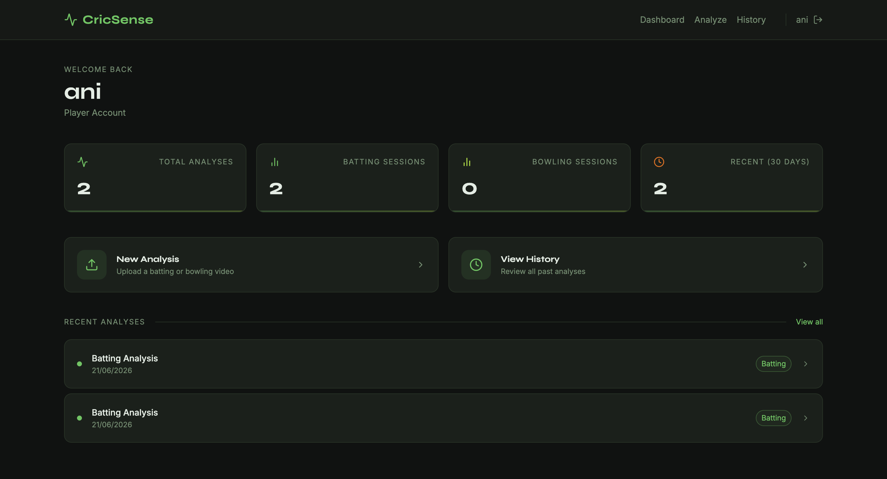
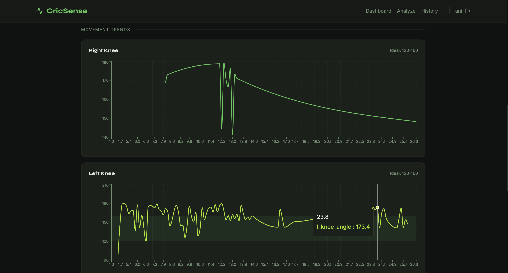
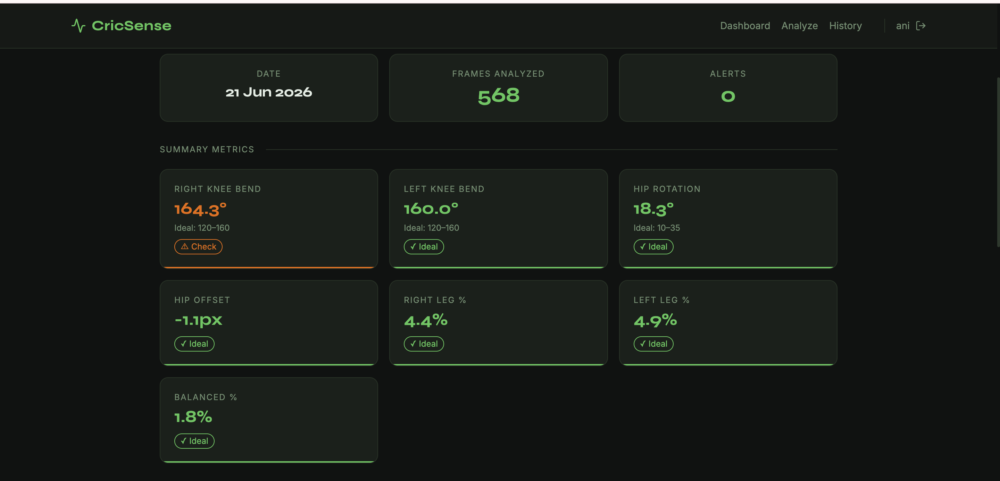
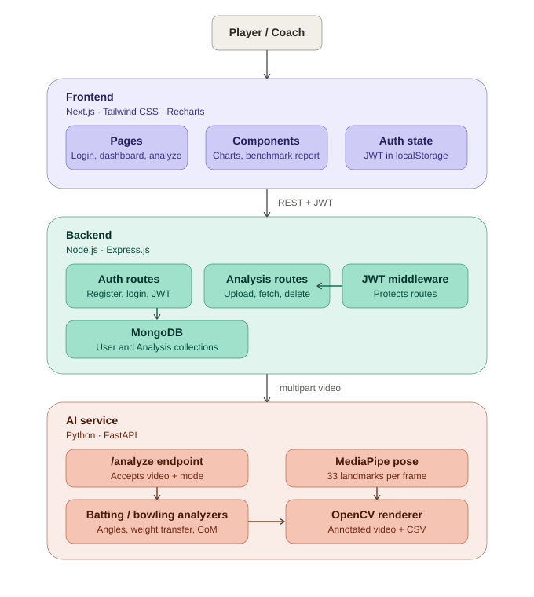

# 🏏 CricSense — AI Cricket Biomechanics Analyzer

Full-stack AI-powered cricket biomechanics analysis platform for players and coaches.

## Tech Stack

| Layer      | Technology                          |
|------------|-------------------------------------|
| Frontend   | Next.js 14 · Tailwind CSS · Recharts |
| Backend    | Node.js · Express.js · JWT · MongoDB |
| AI / CV    | Python · FastAPI · MediaPipe · OpenCV |
| Database   | MongoDB                              |
| Storage    | Cloudinary optional, local fallback  |

---

## Project Structure

```
cricsense/
├── ai/                    # Python FastAPI + MediaPipe
│   ├── main.py            # FastAPI entry point
│   ├── requirements.txt
│   └── analyzers/
│       ├── __init__.py    # Shared utilities & drawing
│       ├── batting.py     # Batting analysis logic
│       └── bowling.py     # Bowling analysis logic
│
├── backend/               # Node.js Express API
│   ├── server.js          # Entry point
│   ├── .env               # Environment variables
│   ├── models/
│   │   ├── User.js        # User schema (JWT auth)
│   │   └── Analysis.js    # Analysis schema
│   ├── routes/
│   │   ├── auth.js        # Register / Login / Me
│   │   ├── analysis.js    # Upload / Fetch / Delete
│   │   └── user.js        # Profile
│   └── middleware/
│       └── auth.js        # JWT middleware
│
└── frontend/              # Next.js web app
    ├── pages/
    │   ├── index.js       # Landing page
    │   ├── login.js       # Login
    │   ├── register.js    # Register
    │   ├── dashboard.js   # User dashboard
    │   ├── analyze.js     # Upload & analyze
    │   └── analysis/[id].js # Results dashboard
    ├── components/
    │   ├── ui/
    │   │   ├── Navbar.js
    │   │   └── MetricCard.js
    │   └── dashboard/
    │       ├── MotionCharts.js
    │       └── BenchmarkReport.js
    └── lib/
        └── api.js         # Axios instance
```

---

## Setup & Running

### Prerequisites
- Node.js 18+
- Python 3.10 (via conda)
- MongoDB running locally

---

### 1. AI Service (Python FastAPI)

```bash
cd ai

# Create conda env (first time only)
conda create -n pose_env python=3.10 -y
conda activate pose_env

# Install dependencies
pip install -r requirements.txt

# Start AI server
uvicorn main:app --host 0.0.0.0 --port 8000 --reload
```

AI API runs at → https://cricsense-ai-slvx.onrender.com

---

### 2. Backend (Node.js)

```bash
cd backend

# Install dependencies
npm install

# Make sure MongoDB is running
# Edit .env if needed (MONGO_URI, JWT_SECRET)

# Start backend
npm run dev
```

Backend runs at → https://cricsense-ytl3.onrender.com

---

### 3. Frontend (Next.js)

```bash
cd frontend

# Install dependencies
npm install

# Start frontend
npm run dev
```

Frontend runs at → https://cricsense.vercel.app/

---

## API Endpoints

### Auth
| Method | Endpoint             | Description     |
|--------|----------------------|-----------------|
| POST   | /api/auth/register   | Create account  |
| POST   | /api/auth/login      | Login           |
| GET    | /api/auth/me         | Current user    |

### Analysis
| Method | Endpoint              | Description          |
|--------|-----------------------|----------------------|
| POST   | /api/analysis/upload  | Upload video         |
| GET    | /api/analysis/history | List user analyses   |
| GET    | /api/analysis/:id     | Get analysis by ID   |
| DELETE | /api/analysis/:id     | Delete analysis      |

### AI (internal)
| Method | Endpoint   | Description        |
|--------|------------|--------------------|
| POST   | /analyze   | Process video      |
| GET    | /health    | Health check       |

---

## Features

- **JWT Authentication** — register/login as player or coach
- **Batting Analysis** — weight transfer, knee angles, hip rotation, CoM trail
- **Bowling Analysis** — arm arc, hip-shoulder separation, front knee, trunk lean
- **Benchmark Alerts** — green/amber/red vs professional standards
- **Motion Graphs** — interactive Recharts with ideal range bands
- **Results Dashboard** — per-analysis page with all metrics
- **Cloud Video Storage** — optional Cloudinary persistence for original uploads, annotated videos and CSV exports
- **CSV Export** — frame-by-frame data download
- **Polling** — results page auto-refreshes while processing

### Optional Cloudinary Storage

Set these backend environment variables to persist artifacts in Cloudinary:

```bash
CLOUDINARY_CLOUD_NAME=your_cloud_name
CLOUDINARY_API_KEY=your_api_key
CLOUDINARY_API_SECRET=your_api_secret
```

If these values are empty, CricSense keeps using local AI download URLs for demo runs.

---

## Resume Description

**CricSense — AI Cricket Biomechanics Analyzer | Python, MediaPipe, OpenCV, FastAPI, Node.js, Express, MongoDB, Next.js, Tailwind**

*Built a full-stack AI sports analytics platform for cricket players and coaches.*

- Engineered a Python FastAPI microservice using MediaPipe to perform frame-by-frame pose estimation, computing 8+ biomechanical metrics (joint angles, weight transfer, hip-shoulder separation) with benchmark comparison against professional standards.
- Built a RESTful Node.js/Express backend with JWT authentication, MongoDB persistence and async video processing pipeline connecting the frontend to the AI service.
- Developed a Next.js/Tailwind frontend with interactive Recharts motion graphs, color-coded benchmark reports and a per-user analysis dashboard with real-time polling.

- ## Screenshots

### Landing Page


### Upload Video


### Dashboard


### Analysis Results


### Motion Graphs


### Analyzed Video


## Documentation

- [Architecture Overview](docs/ARCHITECTURE.md)
- [Project Documentation](docs/DOCUMENTATION.md)

## Architecture Diagram


